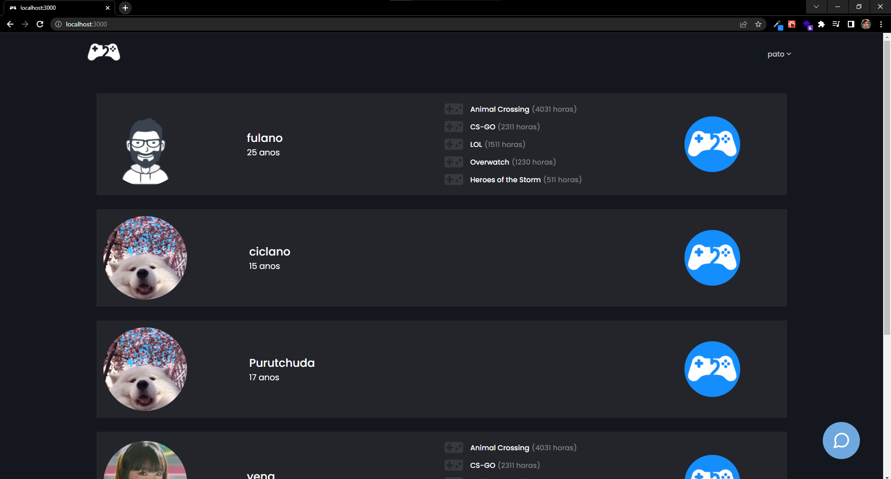

# Projeto Web GamerMatch
Encontre seu duo.

## Sobre

- GamerMatch é uma aplicação web que permite jogadores encontrar outros jogadores baseado em seus gostos pessoais por jogos. 
- O jogador ao se cadastrar na plataforma pode gerenciar seu perfil público definindo sua lista de jogos favoritos (talvez implementaremos integração com API da Steam).
- Na página de Match o jogador pode realizar um match (semelhante ao Tinder) com outro jogador, liberando a interação por chat.
- 

## Como iniciar backend após clonar repositório:
- cd server
- npm i
- dotenv -e .env -- yarn dev

## Como inciar frontend após clonar repositório:
- cd gamer-match
- npm i
- dotenv -e .env -- yarn dev
- Endereço: http://localhost:3000

## .env
Necessário adicionar arquivo .env em /server para ter acesso ao BD.

- DATABASE_URL="postgres://usuario:senha@ip/postgres"
- GOOGLE_CLIENT_ID=
- SERVER_SECRET=""
- SOCKET_ENDPOINT="http://localhost:3000"

Necessário adicionar arquivo .env.local em /gamermatch para ter acesso a login e games.
- NEXT_PUBLIC_GOOGLE_CLIENT_ID=
- GOOGLE_CLIENT_SECRET=
- NEXT_PUBLIC_GAMES_API_RAWG=
